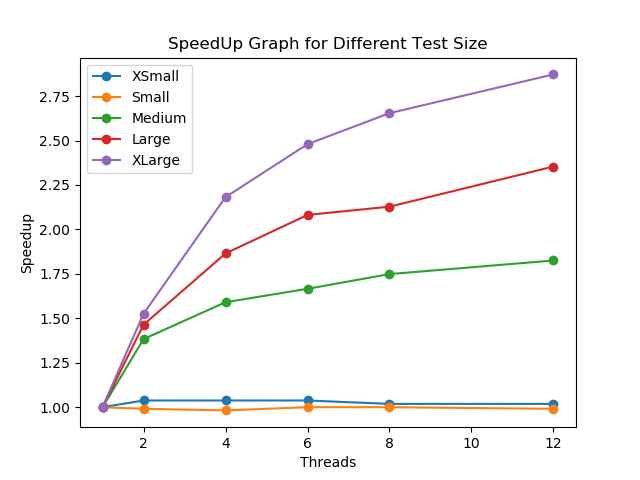

# Analysis

## Part 5:
- All tests cases passed for `go run proj1/grader proj1`
- Best Time taken for twitter.go : `99 sec`

## Part6:
- script for running benchmarks and results received is in `/proj1/benchmark` 
- Batch script for becnhmarking job is in `/proj1/benchmark/benchmark-proj1.sh`
- Ploting script : `proj1/benchmark/plot.py`
- SpeedUp Graph 

## Part7:
- A brief description of the project (i.e., an explanation what you implemented in feed.go, server.go, twitter.go.

### Feed

The feed is a linkedlist with the most recent posts on top. The feed uses the following functions : Add, Remove, Contains. While adding and removing (write operation) Write Lock is used (rwlock.go). for contains (read operation) Read lock (rwlock.go) is used.

### Server

In server.go I have two main functions producer and consumer. The produce enqueue data into the queue and consumer is the one dequeing the queue. Here for the queue I have implemented the `LockFreeQueue (queue/lockfree.go)`. When parallel, its important to use semaphores so that multiple threads dont change the same element of the queue. For semaphores I have implenented using conditional variables.

### Twitter

In twitter.go takes the input and based on the arguments create parallel or serial config. This config is then sent to the server (Run function).

---

- Instructions on how to run your testing script. We should be able to just run your script. However, if we need to do another step then please let us know in the report.

Run `sbatch benchmark-proj1.sh`

- As stated previously, you need to explain the results of your graph. Based on your implementation why are you getting those results? 

The speedup graph shows that as we increase the thread count, there is nearly no speed up for xsmall and small test size. Whereas there is considerable speedup in case of medium, large and xlarge test size.

Which makes sense, since with smaller test size not all threads will be used or get enough amount of work. Thus we do no see any speedup. There is also a possibility of decrease in speedup due to thread overhead.

Answers the following questions:

- What affect does the linked-list implementation have on performance? Does changing the implementation to lock-free or lazy-list algorithm size improve performance? Experiment with this by substituting your lazy-list implementation from homework 4. You should only need to make a few modifications to make this work.

The linkedList implemetation is coarse grain lock based implentation. This will have significant impact on performance, in place of this if we used lock-free or lazy-list algorithm can potentially improve performance in heavily contended scenarios, where the linked-list implementation would otherwise become a bottleneck.

- Based on the topics we discussed in class, identify the areas in your implementation that could hypothetically see increases in performance if you were to use a different synchronization technique or improved queuing techniques. Specifically, look at the RW lock, queue, and producer/consumer components and how they all might be affecting performance. Explain why you would see potential improvements in performance based on either keeping these components are substituting them out for better algorithms.

In this case we use coarse grained we could have used  fine grained or optimised lock method to improve performance.

- Does the hardware have any affect on the performance of the benchmarks?

Yes when code was run without sbatch it took longer as compared to the sbatch (without sbatch the space was shared and with sbatch we get exclusive access).

Collaborated with : Nishchay Karle

